# **Traffic Sign Recognition**
### Author: Farhan Ahmad <farhanhubble@gmail.com>
### Date: May 10, 2017

---

### Goals And Rubric
The [rubric](https://review.udacity.com/#!/rubrics/480/view) for this project has roughly the following requirements.

* Load the data set (see below for links to the project data set)
* Explore, summarize and visualize the data set
* Apply any preprocessing, if needed.
* Design, train and test a model architecture
* Use the model to make predictions on new images
* Analyze the softmax probabilities of the new images
* Summarize the results with a written report
---

The project code is available as an [IPython notebook](https://github.com/farhanhubble/traffic-signs-classifier/blob/master/Traffic_Sign_Classifier.ipynb) on GitHub. Described below is the outline of the analysis done in the notebook.

### Data Set Summary

The dataset was downloaded from [this]('https://d17h27t6h515a5.cloudfront.net/topher/2017/February/5898cd6f_traffic-signs-data/traffic-signs-data.zip') url and training validation and testing files were extracted in step 0 in the notebook.

In step 1 the dimesnsions of the data were summarized. Here's how the dataset looks:

* There were 34799 training samples.
* The test set had 12630 samples.
* Every sample was a 32x32x3 image of type uint8.
* There were 43 different classes.

### Data Exploration

#### Visual Inspection
A set of 64 random samples from the training set were plotted as a 8x8 grid. Motion blur, low brightness made some samples hard to recognize, even manually. Some samples also appeared very bright and the details were washed out. This step could be repeated with similar results. Shown below is one such random set of images.

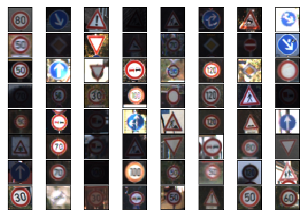

#### Image Exposure Analysis
To find the extent of under/over-exposure a histogram of all images in the training set was plotted. The histogram showed a massive hump centered around brightness level 25 and a spike right at brightness level 255.

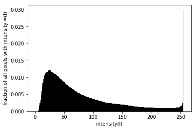

A cumulative histogram showed that nearly 70% of pixels had brightness level below 100.

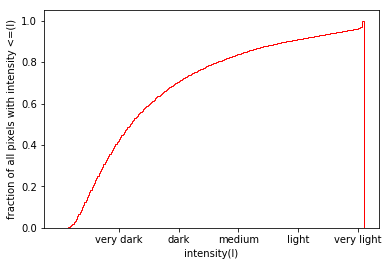

#### Dataset Skew Analysis
Frequency of class labels was plotted for train, validation and test set and it was observed that some classes had as many as 10 times the number of samples in other classes. This pattern was present in all three datasets.

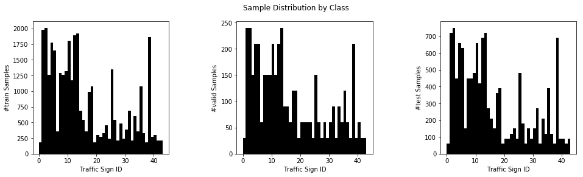

### Design and Test a Model Architecture

#### Pre-processing

**Histogram Equalzation** During training, it was observed that correcting the brightness of training images yielded 1-2% improvement in the final training accuracy.

To improve the brighness of images, histogram equalization was applied to all three sets. To carry out equalization, every RGB image was first converted to YUV format, then histogram correction was applied to the Y channel (channel 0 in a 32x32x3 YUV image) and finally the image was converted back to RGB. Shown below is a sample of histogram-corrected images that are easier to recognize even manually.

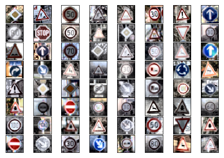

**Synthetic Data Generation** During initial training the training accuracy would cross 98% but validation accuracy was about 3-4% lower and test accuracy was up to 7% lower than training accuracy. This suggested a high variance problem in the model, where additional data could help the model learn better.

In addition, some classes had just a few hundred samples in the training set and fewer samples in the validation set and a model could overlook their misclassification without affecting the accuracy too much.

Additional data was generated by applying random rotation and translation to every image in the training set. Images were rotated by random angles up to +/- 10° around a random point near the center (12-20 pixels) then translated in both x and y directions by random offsets in the range +/-2 pixels.

Since the dataset was already split, and the model had to have a 93% validation accuracy on the given validation set, no augmentation was done for the validation or test set. The number of extra samples generated for each class depended on the number of its existing samples and after augmentation each class had about 5k samples. The augmented training set had 229281 samples.

**Data Normaization** In the orignal datasets, pixel values were in the range [0,255]. Normalizing the data greatly sped up the training process. RGB channel means and standard deviations were calculated over all images in the training data. The means were subtracted from all images in all three sets and then they were divided by the channel-wise standard deviations.

#### Model Architecture Selection
The model architecture is almost the LeNet5 architecture except that the output layer has size 43 instead of 10. The architecture seems to perform well enough so no other changes were made.

The model has following sequental layers:

| Layer             |     Description	                            |
|:-----------------:|:-------------------------------------------:|
| Input         		| 32x32x3 RGB image   							          |
| Convolution 5x5   | 1x1 stride, valid padding, outputs 28x28x6  |
| Max Pooling 2x2   | 2x2 stride, valid padding, outputs 14x14x6  |
| RELU					    |	outputs 14x14x6											        |
| Convolution 5x5   | 1x1 stride, valid padding, outputs 10x10x16 |
| Max Pooling 2x2   | 2x2 stride, valid padding, outputs 5x5x16   |
| RELU					    |	outputs 5x5x16											        |
| Flatten       		| outputs 400                                 |
| Dense             | outputs 120                                 |
| Dense             | outputs 84                                  |
| Dense             | outputs 43                                  |

The model uses softmax layer to compute the classification probabilities. A cross entropy cost funtion is used that is optimized using Adam optimizer.

#### Model training
The functions train() and evaluate() are used for training and evaluating a model.

All hyper parameters were selected using the  validation set. A learning rate of 0.001 was found to be optimal for the Adam optimizer. Higher learning rates caused faster training initially but resulted in training accuracy thrashing in later stages. Lower learning rate, for example 0.0003, caused training to be severely slow towaards the end.

A batch size of 128 was selected keeping in mind the large number of training examples. The main consideration was training speed as final accuracies didn't seem to be affected by batch size.

Droupout was added to minimize overfitting. Without any dropout validation accuracy would plateau even as training accuracy would keep improving. A keep probability of 0.3 appeared to give best results. Higher values caused training to become slow and the final accuracy wouldn't cross 98% even after 400-500 iterations.

Finally, the number of epochs were chosen as 130. It was observed that after data augmentation training took significantly longer than the 30 epochs being used with the original dataset. The improvement in accuracy also slowed down **exponentially** with the number of iterations. For example training accuracy reached ~97% by 30 epochs but 99% accuracy could only be attained after 100 epochs. By 130 epochs both training and validation accuraacies peaked and no further improvement could be observed.

The final accuracies were:
* training set accuracy of 98.0%
* validation set accuracy of 100.0%
* test set accuracy of 95.1%

#### Model Performance Analysis
Because the validation set was small and not augmented either, a high validation set accuracy didn't translate into as good a test accuracy.

A subset of the incorrectly classified samples was plotted aloghwith their target labels. In the figure below a few misclassified samples can be seen.

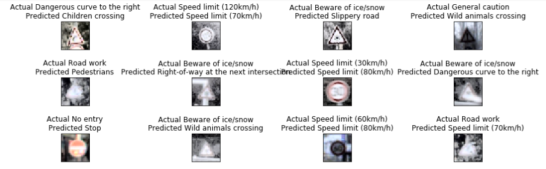_

In many cases the cause of the confusion was obvious. For example 60 km/h could be confused with 80 km/h in a blurred image. For some others like confusing caution with wild animals the likely cause was not evident.

More insight was obtained by looking at the confusion matrix, precision and recall values. Some finer high-level features seem to be overlooked by the model. For example, 'general caution' with an exclaimation mark was confused with 'pedestrian' having a human figure in the middle. More analysis is available in the notebook.

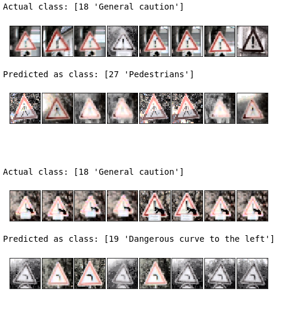

### Test Model on New Images

5 arbitrarily chosen images of German traffic signs were downloaded off the web. These images are shown below alongwith the reason the model could misclassify them.

 This sign is attached to a pole that is visible in the image.

 The actual sign is very tiny.

 These is some text below the sign that is only partially visible.

 The image has perspective distortion.

 The image is slightly blurred.

Here are the results of the prediction:

| Image			        |     Prediction	        					|
|:-----------------:|:---------------------------------:|
| Bumpy Road     		| Bumpy Road  									    |
| Genral Caution    | Priority Road   									|
| No vehicles				| No vehicles											  |
| Stop  	      		| Stop            					 				|
| Road work     		| Road work           							|

The model was able to correctly guess 4 of the 5 traffic signs, that is it has  an accuracy of 80%.

For the first image, the model was absolutely confident that it was a bumpy road sign (probability of 1.0). The top five soft max probabilities were

| Probability         	|     Prediction	   |
|:---------------------:|:------------------:|
| 1.0         			    | Bumpy Road  			 |
| 0.0    				        | Bicyces Crossing	 |
| 0.0 					        | Road Work		       |
| 0.0 	      			    | Children Crossing	 |
| 0.0 				          | Road Narrows Right |

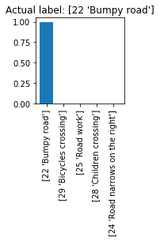

For the second image of a general caution sign the classifier didn't output the corect label in top 5. Instead the labels predicted were as below:

| Probability         	|     Prediction	                     |
|:---------------------:|:------------------------------------:|
| 0.57         			    | Priority Road                        |
| 0.32     				      | No Entry	 	                         |
| 0.07				          | Road Work      				               |
| 0.04		      			  | Stop                                 |
| 0.00					        | No Passing For Vehicles Over 3.5 Ton |

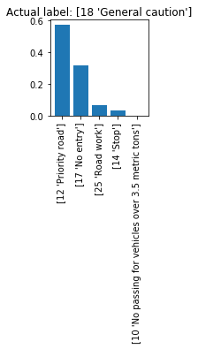

For the third image of no vehicles sign the best prediction was correct and had a high probability of 1.0. All other predictions had 0 probability.

| Probability         	|     Prediction	     |
|:---------------------:|:--------------------:|
| 1.0        			      | No Vehicles   			 |
| .20     				      | Speed Limit 70 	km/h |
| 0.0					          | Speed Limit 50 	km/h |
| 0.0      			        | Yield					       |
| 0.0				            | Speed Limit 30 	km/h |

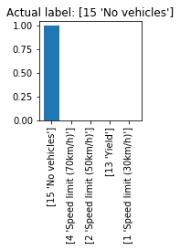

For the fourth image of a stop sign the correct label had probability 1.0 while others were 0.0 .

| Probability         	|     Prediction	     |
|:---------------------:|:--------------------:|
| 1.0        			      | Stop   					     |
| 0.0     				      | No Vehicles 				 |
| 0.0 				          | Road Work            |
| 0.0       			      | Yield					 			 |
| 0.0 			            | Priority Road        |

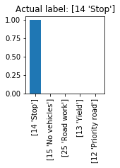

For the fifth image of road work the model was absolutely certain and predicted the correct label with a probaility of 1.0

| Probability         	|     Prediction	                       |
|:---------------------:|:--------------------------------------:|
| 1.0        			      | Road Work 				                     |
| 0.0     				      | Beware of Ice/Snow                     |
| 0.0 				          | Bumpy Road                             |
| 0.0       			      | Bicycles Crossing 	 			             |
| 0.0 			            | Road Narrows Right                     |

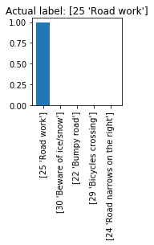

### Peeking Inside The Network
The 5 web images used for testing above were passed throught the network and the activation maps of the convolution layers were visualized. The first convoution layer had clearly learned to recognize edges. Outlines of important shapes and text boundaries were visible in the activtion of the layers map.

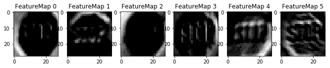

When the only misclassified image of a caution sign was fed, the first convolution layer recognized the trianngular outlines of the signboard, the '!' symbol in the middle also seemed to trigger activations and it was not clear what
could possibly have misled the classifier to predict a priority road.

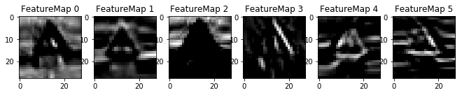

As an experiment, a single image of a priority road sign was also examined. Now the activation map showed bright cells corresponding to the outlines  of the rectangular sign board. No clear cause of misclassification could be ascertained from the activations of the first convolution layer alone.

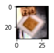
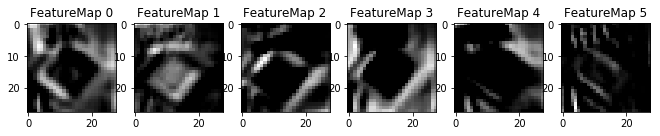

The second convolution layer's activations were not interpretable in this way but being able to map those activations back to pixels in the image would help immensely in debugginh the model. The idea of deconvolution ([Zeiler et. al.](https://www.cs.nyu.edu/~fergus/papers/zeilerECCV2014.pdf)) can be used to perform such a mapping in future.
